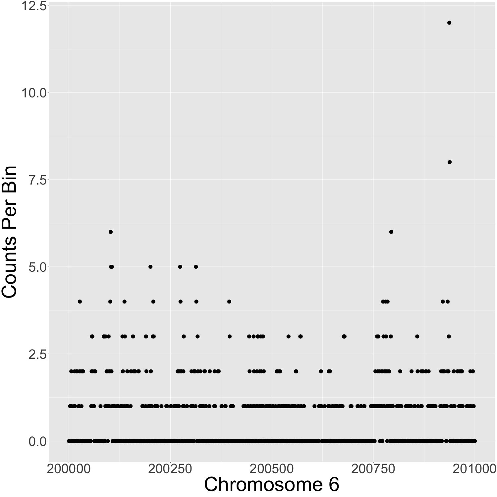
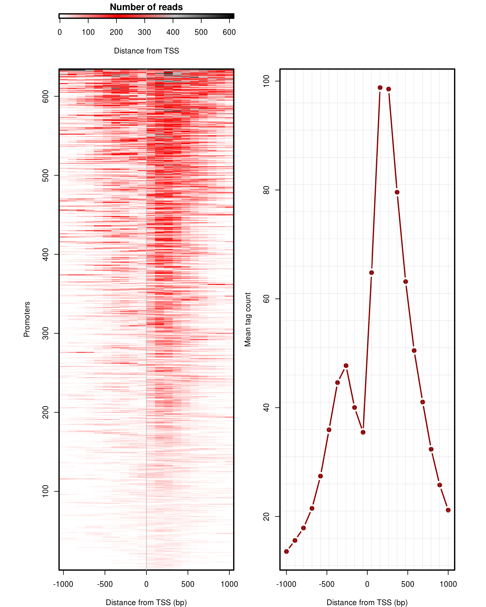

This ChIP-seq pipeline is based on a [Bioconductor ChIP-seq workflow](https://www.bioconductor.org/help/course-materials/2016/CSAMA/lab-5-chipseq/Epigenetics.html). Included also are the following steps, but I've included the following changes:

1. Download and use real experimental data files and process them ourselves rather than use the pre-packaged and pre-processed data from the "EpigeneticsCSAMA" library.
2. Move the appendix to the top of the pipeline which contains instructions for downloading and processing the files.
3. Automate some sections using Bash.
4. Replace rmdup (obsolete) with markdup for removing read duplicates.
5. Some commands using BioMart were not functioning correctly.
6. Replace 'plot' from base R with ggplot2 which offers more flexibility regarding visualisation.
7. Export plots as image files.

Not written here currently are the analysis details, which can be read on the [original Bioconductor tutorial](https://www.bioconductor.org/help/course-materials/2016/CSAMA/lab-5-chipseq/Epigenetics.html). I may add my own explanations and interpretations here later.

### 1.0 - Download fastq files:

##### For our reference, the experiment samples are:

* [SRR066787 - Seq for whole cell extract from ES (129JAE-C56/B6)cells](https://www.ebi.ac.uk/ena/browser/view/SRR066787?show=reads)
* [SRR066766 - ChIP-Seq for H3K27ac in ES (129JAE-C57/B6) cells1](https://www.ebi.ac.uk/ena/browser/view/SRR066766?show=reads)
* [SRR066767 - ChIP-Seq for H3K27ac in ES (129JAE-C57/B6) cells2](https://www.ebi.ac.uk/ena/browser/view/SRR066767?show=reads)

#### 1.1 - Download the relevant fastq files

Make a new directory and create an empty Bash script (Mac terminal):
```{code_1-1-1}
mkdir biocond-ChIP-seq
cd biocond-ChIP-seq
```

#### 1.2 - Download the mouse genome from Ensembl

Download the mouse genome (NCBIM37 / mm9) from Ensembl using curl (~800MB, Mac terminal):
```{code_1-2-1}
curl ftp://ftp.ensembl.org/pub/release-67/fasta/mus_musculus/dna/Mus_musculus.NCBIM37.67.dna.toplevel.fa.gz -o mouse_NCBIM37.fa.gz
```

Index the mouse genome using bowtie2 (Mac terminal) (bowtie2 can be installed using Homebrew: brew install bowtie2).
This step takes ~20 mins with 12 threads. '-–threads' indicates the number of CPU threads to dedicate to the alignment task (in the case below, 12 threads). You can determine the number of threads your Mac has using the 'sysctl -n hw.ncpu' command from the terminal):
```{code_1-2-2}
bowtie2-build --threads 12 mouse_NCBIM37.fa.gz mouse_NCBIM37_build
```

#### 1.3 - Download the fastq.gz files

Create a bash script called 'dl-reads.sh' (Mac terminal):
```{code_1-3-1}
touch dl-reads.sh
```

Put the following commands into the 'dl-reads.sh' Bash script. This script can download the desired experiment fastq files using [wget](https://ena-docs.readthedocs.io/en/latest/retrieval/file-download.html#using-wget) (wget can be installed using Homebrew (brew install wget). Each zipped fastq file is ~500MB:
```{code_1-3-2}
#!/usr/local/bin/bash
wget ftp://ftp.sra.ebi.ac.uk/vol1/fastq/SRR066/SRR066787/SRR066787.fastq.gz
wget ftp://ftp.sra.ebi.ac.uk/vol1/fastq/SRR066/SRR066766/SRR066766.fastq.gz
wget ftp://ftp.sra.ebi.ac.uk/vol1/fastq/SRR066/SRR066767/SRR066767.fastq.gz
```

Run the Bash script above (Mac terminal). The files can also be [downloaded directly](https://www.ebi.ac.uk/ena/browser/view/PRJNA133681) if wget isn't working:
```{code_1-3-3}
bash dl-reads.sh
```

#### 1.4 - Assess read quality in RStudio

Use R in RStudio to assess the read quality of the fastq.gz files once downloaded:
```{code_1-4-1}
workDirectory <- "~/biocond-ChIP-seq"
setwd(workDirectory)

fls <- list.files(workDirectory, ".fastq.gz", full=TRUE)
names(fls) <- sub(".fastq.gz", "", basename(fls))
```

This next step takes some time, and will generate a report at the end:
```{code_1-4-2}
# BiocManager::install("ShortRead")
library(ShortRead)
qas <- lapply(seq_along(fls),
              function(i, fls) qa(readFastq(fls[i]), names(fls)[i]),
              fls)
qa <- do.call(rbind, qas)
rpt <- report(qa,dest = c('QA_report.html'))
```

#### 1.5 - Process the fastq.gz files using bash

Install MACS-1.4.2. Note: MACS-1-4-2 requires Python2 to be installed (Mac terminal):
```{code_install_macs14}
wget https://github.com/downloads/taoliu/MACS/MACS-1.4.2-1.tar.gz
tar -zxvf MACS-1.4.2-1.tar.gz
cd MACS-1.4.2
python setup.py install
```

Change directory back to our work directory (Mac terminal):
```{cd-back}
cd "~/biocond-ChIP-seq"
```

Create a bash script file called "fastq-process.sh" (Mac terminal):
```{code_1-5-1}
touch fastq-process.sh
```

Insert the following bash code in "fastq-process.sh", which will process the fastq.gz files and detects peaks using MACS-1-4-2. Details for each step are contained within comments in the code:
```{code_1-5-2}
#!/usr/local/bin/bash

# Declare variables:
declare -a sampleIDArray=("SRR066787" "SRR066766" "SRR066767") # All sample IDs
declare -a experimentIDArray=("SRR066766" "SRR066767") # Experimental sample IDs
negControlID="SRR066787" # Negative control ID
builtGenomeFilename="genome" # Genome file built using bowtie2
cpu_threads=12 # Number of CPU threads to use for processing

# Process the fastq files using a loop:
for sampleID in ${sampleIDArray[@]}; do
   # Use gzcat to unzip the fastq files:
   # echo "Unzipping ${sampleID}.fastq.gz to ${sampleID}.fastq..."
   # gzcat ${sampleID}.fastq.gz > ${sampleID}.fastq
   
   # Use bowtie2 to convert fastq files to sam files:
   # Notes:
   # -x indicates the reference genome
   # -S indicates the SAM file output
   # -U indicates the fastq file that needs to be aligned
   # -q can be added to specify to print only error messages rather than all messages.
   echo "Using bowtie2 to convert ${sampleID}.fastq to ${sampleID}.sam..."
   bowtie2 --threads $cpu_threads -x $builtGenomeFilename -U ${sampleID}.fastq -S ${sampleID}.sam

   # Generate bam files from the sam files generated in the previous step using samtools.
   # samtools must be installed separately (i.e. using Homebrew: brew install samtools).
   echo "Using samtools to convert ${sampleID}.sam to ${sampleID}.bam..."
   samtools view -bh -q 40 ${sampleID}.sam > ${sampleID}_bestAlignment.bam

   # Use samtools to remove PCR duplicates:
   echo "Using samtools to remove PCR duplicates..."
   samtools collate ${sampleID}_bestAlignment.bam -o ${sampleID}_collate.bam
   samtools fixmate -m ${sampleID}_collate.bam ${sampleID}_fixmate.bam
   samtools sort ${sampleID}_fixmate.bam -o ${sampleID}_sort.bam
   samtools markdup --threads $cpu_threads -rs ${sampleID}_sort.bam ${sampleID}_filtered.bam

   # Use bedtools to transform the .bam format reads to .bed format
   # bedtools must be installed separately (i.e. using Homebrew: brew install bedtools).
   echo "Using bedtools to convert ${sampleID}.bam to ${sampleID}.bed..."
   bedtools bamtobed -i ${sampleID}_filtered.bam > ${sampleID}_filtered.bed

   # Use awk to add 'chr' to the first data column to indicate 'chromosome'.
   echo "Using awk to format data in ${sampleID}.bed file..."
   awk '$0="chr"$0' ${sampleID}_filtered.bed > ${sampleID}_filtered_ucsc.bed
   awk '{if($1=="chr6") print $0}' ${sampleID}_filtered_ucsc.bed > ${sampleID}_filtered_ucsc_chr6.bed
done

# Perform MACS14 peak detection for non-control samples in a loop:
for experimentID in ${experimentIDArray[@]}; do
   echo "Using MACS1.4 to idendify peaks in ${experimentID}_filtered_ucsc.bed"
   # -c control
   # -t IP data file
   # -f format of bed file
   # -g mappable genome size
   macs14 -t ${experimentID}_filtered.bed -c ${negControlID}_filtered_ucsc.bed -f BED -g mm --nomodel -n ${experimentID}_macs14_ucsc
   awk '$0="chr"$0' ${experimentID}_macs14_peaks.bed > ${experimentID}_macs14_peaks_ucsc.bed
   awk '{if($1=="chr6") print $0}' ${experimentID}_macs14_peaks_ucsc.bed > ${experimentID}_macs14_peaks_ucsc_chr6.bed
done
```

```{code_1-5-2}
bash fastq-process.sh
```

### 2.0 - Prepare genome objects using R

#### 2.1 - Obtaining object si for the mouse genome

Note: You will need [BiocManager](https://www.bioconductor.org/install/) to install packages from Bioconductor. BiocManager requires the ‘deldir’ library to be installed. But at the time of making this guide, version 1.0.5 for MacOS does not work for Intel processors, as it automatically downloads the ARM64 version if using install.packages(). Install manually by downloading the x86_64 .tgz from CRAN and through RStudio > Tools > Install Packages if using an Intel CPU.

Create an object called 'si' that represents the mouse genome:
```{code_2-1-1}
workDirectory <- "~/biocond-ChIP-seq"
setwd(workDirectory)

# BiocManager::install("BSgenome.Mmusculus.UCSC.mm9")
library(BSgenome.Mmusculus.UCSC.mm9)
genome <- BSgenome.Mmusculus.UCSC.mm9
si <- seqinfo(genome)
si <- si[paste0('chr', c(1:19, 'X', 'Y'))]
```

#### 2.2 - Obtaining object bm for mm9

Generate an object bm that represents mouse genome mm9:
```{code_2-2-1}
# BiocManager::install("biomaRt")
library(biomaRt)
# BiocManager::install("Gviz")
library(Gviz)

mart <- useMart("ensembl", dataset="mmusculus_gene_ensembl")

fm <- Gviz:::.getBMFeatureMap()
fm["symbol"] <- "external_gene_name"

bm <- Gviz::BiomartGeneRegionTrack(chromosome='chr6', genome="mm9", 
                             start=122530000, end = 122900000, 
                             biomart=mart,filter=list("with_refseq_mrna"=TRUE), 
                             size=4, name="RefSeq", utr5="red3", utr3="red3", 
                             protein_coding="black", col.line=NULL, cex=7,
                             collapseTranscripts="longest",
                             featureMap=fm)
```

#### 2.3 - Promoter isolation

Create the egs object, which contains the annotation of the most external 5 and 3 prime UTRs for each gene model:
```{code_2-3-1}
listAttributes(mart)[1:3,]
ds <- useDataset('mmusculus_gene_ensembl', mart=mart)
chroms <- 6

egs <- getBM(attributes = c('ensembl_gene_id',"external_gene_name",
                           'chromosome_name','start_position',
                           'end_position','strand'), 
                           filters='chromosome_name',
                           values=chroms,
                           mart=ds)
```

### 3.0 - Reading the filtered ChIP-seq reads

Read each bed file into R:
```{code_3-0-1}
library(GenomicRanges)
library(rtracklayer)
library(IRanges)

input <- import.bed(file.path(workDirectory, 'SRR066787_filtered_ucsc_chr6.bed'))
rep1 <- import.bed(file.path(workDirectory, 'SRR066766_filtered_ucsc_chr6.bed'))
rep2 <- import.bed(file.path(workDirectory, 'SRR066767_filtered_ucsc_chr6.bed'))

rep1
```

### 4.0 - Preparation of the ChIP-seq and control samples: read extension

```{code_4-0-1}
library(chipseq)

prepareChIPseq <- function(reads) {
    frag.len = median( estimate.mean.fraglen(reads))
    cat(paste0( 'Median fragment size for this library is ', round(frag.len)))
    reads.extended = resize(reads, width = frag.len)
    return(trim(reads.extended))
}

input <- prepareChIPseq(input)

rep1 <- prepareChIPseq(rep1)

rep2 <- prepareChIPseq(rep2)

rep1
```

### 5.0 - Binning the ChIP-seq and control

#### 5.1 - Generation of bins

Generate bins for the data:
```{code_5-1-1}
si

binsize <- 200 
bins <- tileGenome(si['chr6'], tilewidth=binsize,
                  cut.last.tile.in.chrom=TRUE)
bins
```

#### 5.2 - Binning

```{code_5-2-1}
BinChIPseq <- function(reads, bins){
       mcols(bins)$score = countOverlaps(bins, reads) 
       return(bins) 
}

input.200bins <- BinChIPseq( input, bins )
rep1.200bins <- BinChIPseq( rep1, bins )
rep2.200bins <- BinChIPseq( rep2, bins )

rep1.200bins

library(ggplot2)
# 1. Open file
png("img/5-2_rep1_chr6_200bins.png", width = 1500, height = 1500)
# 2. Create the plot
rep1_200bins_df <- data.frame(chr6=200000:201000, counts_per_bin=rep1.200bins$score[200000:201000])
ggplot(rep1_200bins_df, aes(x=chr6, y=counts_per_bin)) +
       geom_point(size = 5) +
       xlab("Chromosome 6") +
       ylab("Counts Per Bin") +
       theme(axis.title.x = element_text(size=60),
             axis.title.y = element_text(size=60),
             axis.text.x = element_text(size=40),
             axis.text.y = element_text(size=40))
# 3. Close the file
dev.off()
```



#### 5.3 - Exporting binned data

```{code_5-3-1}
export(input.200bins, 
       con='input_chr6.bedGraph',
       format = "bedGraph")
export(rep1.200bins, 
       con='H3K27ac_rep1_chr6.bedGraph',
       format = "bedGraph")
export(rep2.200bins, 
       con='H3K27ac_rep2_chr6.bedGraph',
       format = "bedGraph")
```

The exported bedGraph files can be visualised using the [UCSC genome browser](http://genome-euro.ucsc.edu/cgi-bin/hgCustom?hgsid=276456248_W1WP3n8XW4w2dVaH7L4s5h3APsDQ&clade=&org=Mouse&db=0&hgct_do_add=1) or using software like Integrative Genomics Viewer (install using 'brew install --cask firefox' on Mac, requires java).

### 6.0 - Visualisation of ChIP-seq data with Gviz

```{code_6-0-1}
# BiocManager::install("Gviz")
library(Gviz)

bm

AT <- GenomeAxisTrack()

# 1. Open file
png("img/6-0_log2-fold-changes-p-value.png",
    width=2000,
    height=2000,
    res=300,
    pointsize=2)
# 2. Create the plot
plotTracks(c(bm, AT),
           from=122530000, to=122900000,
           transcriptAnnotation="symbol",
           window="auto",
           fontsize=20,
           title.width = 2,
           fontface.main = 2,
           background.title="dark grey")
# 3. Close the file
dev.off()
```


```{code_6-0-2}
input.track <- DataTrack(input.200bins, 
                        strand="*", genome="mm9", col.histogram='gray',
                        fill.histogram='black', name="Input", col.axis="black",
                        cex.axis=0.4, ylim=c(0,150))

rep1.track <- DataTrack(rep1.200bins, 
                        strand="*", genome="mm9", col.histogram='steelblue',
                        fill.histogram='black', name="Rep. 1", col.axis='steelblue',
                        cex.axis=0.4, ylim=c(0,150))

rep2.track <- DataTrack(rep2.200bins, 
                        strand="*", genome="mm9", col.histogram='steelblue',
                        fill.histogram='black', name="Rep. 2", col.axis='steelblue',
                        cex.axis=0.4, ylim=c(0,150))

# 1. Open file
png("img/6-0_tracks-with-genomic-features.png",
    width=2000,
    height=2000,
    res=300,
    pointsize=2)
# 2. Create the plot
plotTracks(c(input.track, rep1.track, rep2.track, bm, AT),
           from=122530000, to=122900000,
           transcriptAnnotation="symbol",
           window="auto", 
           type="histogram",
           background.title="dark grey",
           fontsize=10,
           title.width=2,
           fontface.main=f2)
# 3. Close the file
dev.off()
```


### 7.0 - ChIP-seq peaks

#### 7.1 - Identification of peaks

#### 7.2 - Peaks – basic analysis in R

Process the data files exported by MACS:
```{code_7-2-1}
peaks.rep1 <- import.bed(file.path(workDirectory,'SRR066766_peaks_ucsc_chr6.bed'))
peaks.rep2 <- import.bed(file.path(workDirectory,'SRR066767_peaks_ucsc_chr6.bed'))

peaks1.track <- AnnotationTrack(peaks.rep1, 
                               genome="mm9", name='Peaks Rep. 1',
                               chromosome='chr6',
                               shape='box',fill='blue3',size=2)
peaks2.track <- AnnotationTrack(peaks.rep2, 
                               genome="mm9", name='Peaks Rep. 2',
                               chromosome='chr6',
                               shape='box',fill='blue3',size=2)

# 1. Open file
png("img/7-2_macs-chip-peaks.png",
    width=2000,
    height=2000,
    res=300,
    pointsize=2)
# 2. Create the plot
plotTracks(c(input.track, rep1.track, peaks1.track,
             rep2.track, peaks2.track, bm, AT),
             from=122630000, to=122700000,
             transcriptAnnotation="symbol",
             window="auto", 
             type="histogram",
             cex.title=0.7,
             fontsize=10,
             background.title="dark grey")
# 3. Close the file
dev.off()
```


#### 7.3 - Venn diagrams

```{code_7-3-1}
ovlp <- findOverlaps(peaks.rep1, peaks.rep2)
ovlp

ov <- min(length(unique(queryHits(ovlp))), length(unique(subjectHits(ovlp))))

library(VennDiagram)

# 1. Open file
png("img/7-3_venn-diagram.png",
    width=2000,
    height=2000,
    res=600,
    pointsize=12)
# 2. Create the plot
draw.pairwise.venn( 
   area1=length(peaks.rep1),
   area2=length(peaks.rep2), 
   cross.area=ov, 
   category=c("rep1", "rep2"), 
   fill=c("steelblue", "blue3"),
   cat.cex=1,
   cat.dist=0.05,
   cat.pos=c(-20, 20))
# 3. Close the file
dev.off()
```


```{code_7-3-2}
enriched.regions <- Reduce(subsetByOverlaps, list(peaks.rep1, peaks.rep2))

enr.reg.track <- AnnotationTrack(enriched.regions,
                                genome="mm9", name='Enriched regions',
                                chromosome='chr6',
                                shape='box',fill='green3',size=2)

# 1. Open file
png("img/7-3_enriched-regions.png",
    width=2000,
    height=2000,
    res=300,
    pointsize=2)
# 2. Create the plot
plotTracks(c(input.track, rep1.track, peaks1.track,
             rep2.track, peaks2.track, enr.reg.track, 
             bm, AT),
             from=122630000,
             to=122700000,
             transcriptAnnotation="symbol",
             window="auto", 
             type="histogram",
             background.title="dark grey",
             cex.title=0.5,
             fontsize=10)
# 3. Close the file
dev.off()
```


### 8.0 - Isolation of promoters overlapping H3K27ac peaks

#### 8.1 - Identification of promoters

```{code_8-1-1}
head(egs)

egs$TSS <- ifelse(egs$strand == "1", egs$start_position, egs$end_position)
head(egs)

promoter_regions <- GRanges(seqnames = Rle(paste0('chr', egs$chromosome_name)),
                            ranges = IRanges(start = egs$TSS - 200,
                            end = egs$TSS + 200),
                            strand = Rle(rep("*", nrow(egs))),
                            gene = egs$external_gene_id)

promoter_regions
```

#### 8.2 - Overlapping promoters with H3K27ac enriched regions

```{code_8-2-1}
ovlp2b <- findOverlaps(promoter_regions, enriched.regions)

cat(sprintf("%d of %d enriched regions overlap a promoter.",
   length(unique(subjectHits(ovlp2b))), length( enriched.regions)))

promotor_total_length <- sum(width(reduce(promoter_regions)))
promotor_total_length

promotor_fraction_of_chromosome_6 <- promotor_total_length / seqlengths(si)["chr6"]

binom.test(length(unique(subjectHits(ovlp2b))), length(enriched.regions), promotor_fraction_of_chromosome_6)

pos.TSS <- egs[unique(queryHits(findOverlaps(promoter_regions, enriched.regions))),]
pos.TSS[1:3,]
```

### 9.0 - Analysis of the distribution of H3K27ac around a subset of gene promoters

```{code_9-0-1}
tiles <- sapply( 1:nrow(pos.TSS), function(i)
   if(pos.TSS$strand[i] == "1")
      pos.TSS$TSS[i] + seq( -1000, 900, length.out=20 )
   else
      pos.TSS$TSS[i] + seq( 900, -1000, length.out=20 ) )

tiles <- GRanges(tilename = paste( rep( pos.TSS$ensembl_gene_id, each=20), 1:20, sep="_" ),
                seqnames = Rle( rep(paste0('chr', pos.TSS$chromosome_name), each=20) ), 
                ranges = IRanges(start = as.vector(tiles),
                                 width = 100),
                strand = Rle(rep("*", length(as.vector(tiles)))),
                seqinfo=si)

tiles   

H3K27ac.p <- countOverlaps( tiles, rep1) + countOverlaps( tiles, rep2 )

H3K27ac.p.matrix <- matrix( H3K27ac.p, nrow=nrow(pos.TSS), ncol=20, byrow=TRUE )

colors <- colorRampPalette(c('white','red','gray','black'))(100) 

layout(mat=matrix(c(1,2,0,3), 2, 2), 
       widths=c(2,2,2), 
       heights=c(0.5,5,0.5,5), TRUE)


par(mar=c(4,4,1.5,1))

image(seq(0, max(H3K27ac.p.matrix), length.out=100), 1,
      matrix(seq(0, max(H3K27ac.p.matrix), length.out=100),100,1),
      col = colors,
      xlab='Distance from TSS', ylab='',
      main='Number of reads', yaxt='n',
      lwd=3, axes=TRUE)
box(col='black', lwd=2)
image(x=seq(-1000, 1000, length.out=20),
      y=1:nrow(H3K27ac.p.matrix),
      z=t(H3K27ac.p.matrix[order(rowSums(H3K27ac.p.matrix)),]), 
      col=colors,
      xlab='Distance from TSS (bp)',
      ylab='Promoters', lwd=2)
box(col='black', lwd=2)
abline(v=0, lwd=1, col='gray')
plot(x=seq(-1000, 1000, length.out=20),
     y=colMeans(H3K27ac.p.matrix),
     ty='b', pch=19,
     col='red4',lwd=2,
     ylab='Mean tag count',
     xlab='Distance from TSS (bp)')
abline(h=seq(1,100,by=5),
       v=seq(-1000, 1000, length.out=20),
       lwd=0.25, col='gray')
box(col='black', lwd=2)
```



### 10.0 - Session info

```{code_10-0-1}
sessionInfo()
```
